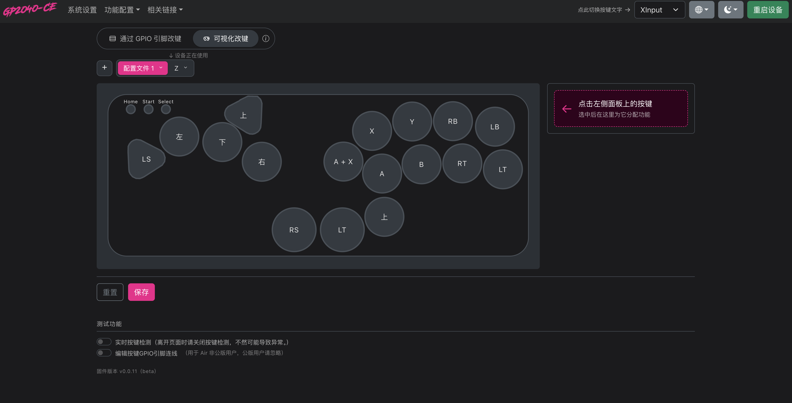

# EasyGP2040 使用说明

> ⚠️ **内测版本**
> 如果遇到卡死，**拔线重新插上就能恢复**。

---

## 一、怎么装固件

1. **按住 Start 键**，把数据线插上电脑
2. 浏览器打开 **192.168.7.1** → 点右上角「**重启设备**」→ 选 **USB (BOOTSEL)**
   → 设备会变成一个 U 盘
3. 把固件文件**拖进这个 U 盘**
   → 等 10 秒左右，设备自动重启，进入手柄模式，装好了

> 固件文件就是邮件里那个 `.uf2`。

---

## 二、怎么进设置

**按住 Start 键，插上数据线开机。**

然后电脑浏览器打开：**192.168.7.1**

进去就是改键界面。改完拔线重插，就能正常打游戏了。

> **Start、Select、X 这三个键都行** —— 按住任意一个再插线，都能进设置。

---

## 三、开机进不同模式

插线的时候按住不同的键：

| 按住 | 进什么模式 |
|---|---|
| **X** | 设置模式（改键用） |
| **A** | 手柄模式（Switch） |
| **B** | 手柄模式（XInput） |
| 不按 | 手柄模式（跟上次的 XInput 或 Switch 一致） |

> Start 和 Select 也能进设置模式，见上一节。

---

## 四、改键

进去看到的那个图，**就是你面板的样子**。

1. **点**面板上你要改的键
2. 右边**选**一个新的键值
3. 改完**不用管**，10 秒后自动保存

> 可以多选。比如同时选 `A` 和 `上`，按一下就同时触发。

**改错了？** 点「重置」，这个键恢复默认。

**保存状态看右上角那个小点：**

- 🟡 黄点 = 还没存
- 🟢 绿点 = 存好了
- 🔴 红点 = 没存上（检查设备连没连上）

着急的话可以点「保存」，立刻存。

---

## 五、改接线（键焊在哪个脚上）

如果你自己焊过线，键接的脚和默认不一样，就要来这里改。

打开底部：**引脚接线编辑器**

1. 点键上面的**灰色小胶囊**（写着 `GP6` 之类）
2. **选**一个新的脚
3. 点「**完成**」

> ⚠️ 只点下拉**不会**改数据，**必须点「完成」才算数**。

**点错了？** 点「恢复初始接线」，全部恢复默认（**键值不会变**）。

**想让某个键没反应？** 选「未连接」。

---

## 六、实时按键检测

底部打开「**实时按键检测**」，然后按你面板上的键，屏幕上对应的键会亮起来。

用来检查接线特别方便。

> ⚠️ **离开这个页面前，请先把它关掉。**

忘了关也没事 —— 界面会弹窗提醒你，不会直接让你走。

---

## 七、几个要注意的

**1. 烧了新固件，先做一次「重置设置」**
（在功能配置里）

**2. 改键前先看顶部那个「↓ 设备正在使用」**
它指的是设备现在用哪套配置。你在别的配置上改，是不会生效的。

**3. 想把两个键的功能对调 → 改键值，不要改接线**
改接线会让屏幕显示的键对不上你按的键。

**4. 改完直接拔线也行**
保存是立刻写进去的，不会丢。

---

## 八、三个「重置」不一样

| 点哪个 | 会恢复什么 |
|---|---|
| 功能配置 → **重置设置** | 所有设置都恢复默认 |
| 改键界面 → **重置** | 只恢复**键值**，接线不动 |
| 引脚编辑器 → **恢复初始接线** | 只恢复**接线**，键值不动 |

---

## 九、默认按键对照

| 面板上的位置 | 键值 |
|---|---|
| 拳脚一排 1 / 2 / 3 / 4 | X / Y / RB / LB |
| 拳脚二排 1 / 2 / 3 / 4 | A / B / RT / LT |
| 加键（一排在右上角） | A + X |
| 大拇指加键 | 上 |
| 底部左 26mm | RS |
| 底部右 26mm | LT |
| W 位拨片 | 上 |
| 键盘 A / S / D 位 | 左 / 下 / 右 |
| Shift 位拨片 | LS |
| 左上功能键 1 / 2 / 3 | Home / Start / Select |

---

## 十、卡死了怎么办

**拔线，重新插上。** 就恢复了。

内测版本偶尔会有这种情况，正常使用不受影响。

---

*有问题找客服。*
